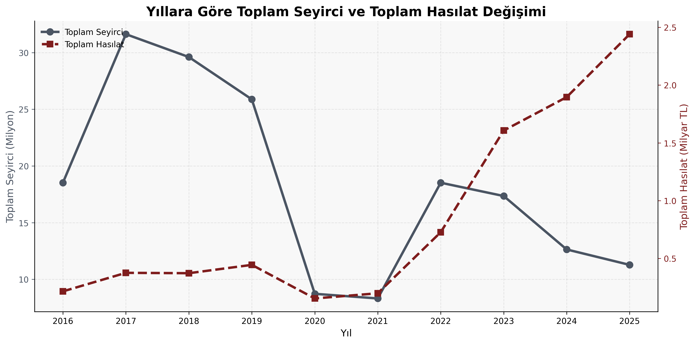
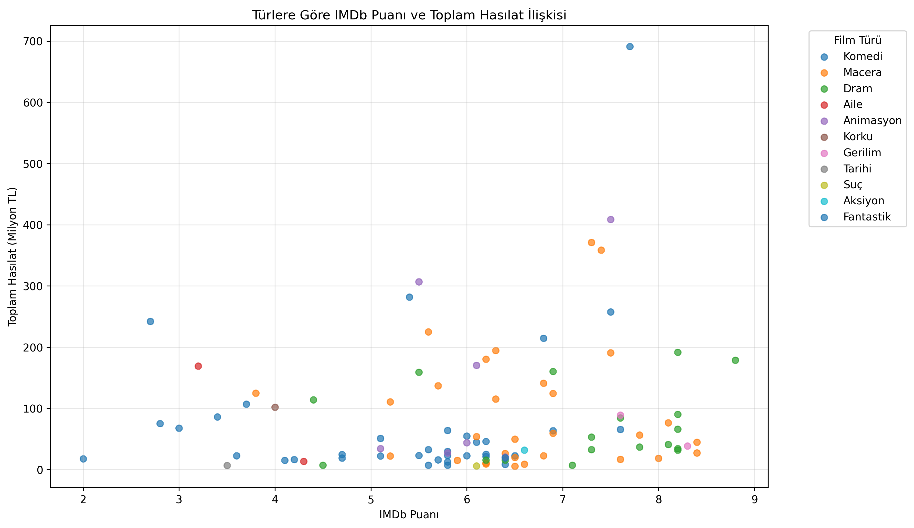
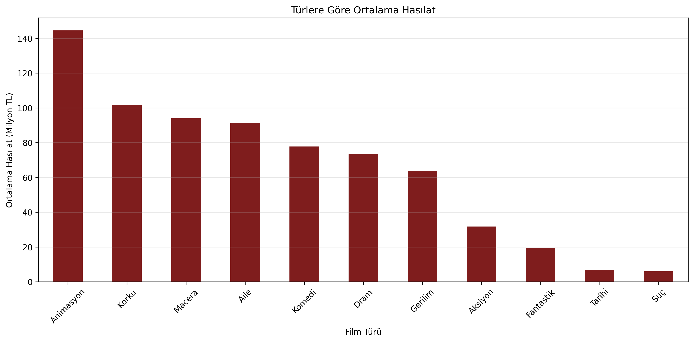
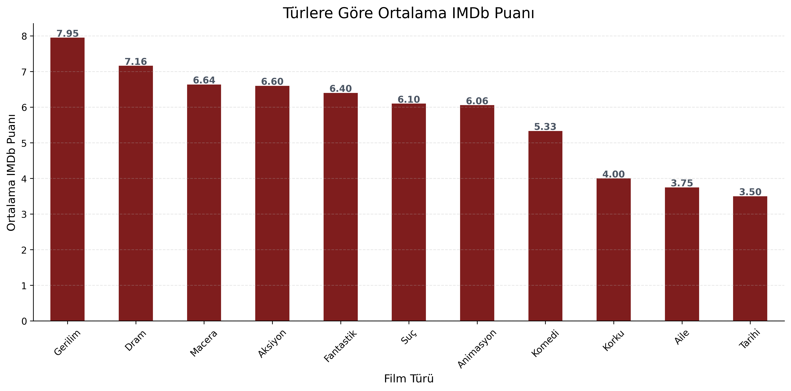
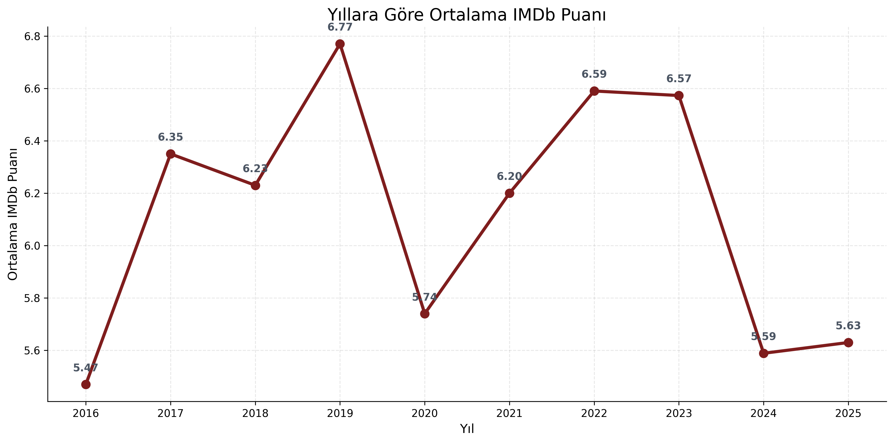
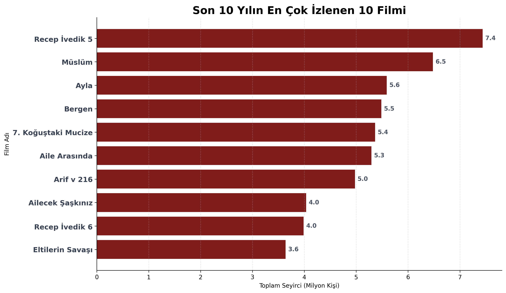

# Türk Sinema Filmleri Veri Analizi

## 🌐 Canlı Rapor

https://zeynepozbey.github.io/sinema-veri-analizi/notebook/film_analizi.html

Bu proje, Box Office Türkiye platformundan elde edilen verilerin derlenmesiyle oluşturulan bir veri seti üzerinde gerçekleştirilmiş bir veri analizi çalışmasıdır.

Bu proje, Box Office Türkiye platformundan elde edilen verilerin derlenmesiyle oluşturulan bir veri seti üzerinde gerçekleştirilmiş bir veri analizi çalışmasıdır.

Çalışmada son 10 yılda vizyona giren filmlerin seyirci sayıları, hasılat değerleri, IMDb puanları ve tür bilgileri incelenmiştir. Analizler Python kullanılarak gerçekleştirilmiş ve sonuçlar çeşitli grafiklerle görselleştirilmiştir.

---

## Veri Kaynağı

Bu çalışmada kullanılan veri seti hazır bir kaynak olarak alınmamıştır.

Veriler, Box Office Türkiye platformunda yer alan film kayıtlarının incelenmesiyle tarafımdan derlenmiş ve analiz için uygun bir veri seti haline getirilmiştir.


İncelenen dönem:

- 2016 – 2025

Veri setinde aşağıdaki değişkenler bulunmaktadır:

- Film Adı
- Vizyon Tarihi
- IMDb Puanı
- Ana Tür
- Türler
- Gösterimde Kalma Süresi (Hafta)
- Toplam Seyirci
- Toplam Hasılat

---

## Kullanılan Teknolojiler

- Python
- Pandas
- Matplotlib
- Jupyter Notebook

---

## Gerçekleştirilen Analizler

### 1. Yıllara Göre Toplam Seyirci ve Toplam Hasılat Değişimi

Sinema sektöründeki yıllık değişimin incelenmesi amacıyla oluşturulmuştur.


Kısa Yorum:
Grafik incelendiğinde 2017–2019 yıllarında seyirci sayılarının yüksek seviyelerde olduğu görülmektedir. 2020 yılında ise hem seyirci sayısında hem de toplam hasılatta belirgin bir düşüş yaşanmıştır. Sonraki yıllarda hasılat artış gösterirken seyirci sayılarının önceki seviyelere tam olarak ulaşmadığı görülmektedir.

---

### 2. Türlere Göre IMDb Puanı ve Toplam Hasılat İlişkisi

Film türleri arasındaki IMDb puanı ve hasılat dağılımlarını göstermektedir.


Kısa Yorum:
Grafikte film türlerinin IMDb puanları ve hasılat değerleri arasında farklı dağılımlar gösterdiği görülmektedir. Yüksek IMDb puanına sahip her filmin yüksek hasılat elde etmediği, buna karşılık bazı filmlerin daha düşük puanlarla yüksek hasılat seviyelerine ulaşabildiği gözlemlenmektedir.

---

### 3. Türlere Göre Ortalama Hasılat

Film türlerinin ortalama hasılat değerlerinin karşılaştırılması amacıyla hazırlanmıştır.


Kısa Yorum:
Türler arasında ortalama hasılat bakımından belirgin farklılıklar bulunmaktadır. Bazı türlerin ortalama gelir düzeylerinin diğer türlere göre daha yüksek olduğu görülmektedir.

---

### 4. Türlere Göre Ortalama IMDb Puanı

Film türlerinin ortalama IMDb puanlarını göstermektedir.


Kısa Yorum:
Grafik, türlerin ortalama IMDb puanlarının birbirinden farklılaştığını göstermektedir. Bazı türler daha yüksek ortalama puanlara sahipken bazı türlerin ortalama puanlarının daha düşük seviyelerde kaldığı görülmektedir.

---

### 5. Yıllara Göre Ortalama IMDb Puanı

Filmlerin yıllara göre ortalama IMDb puanlarındaki değişimi göstermektedir.


Kısa Yorum:
Ortalama IMDb puanlarının yıllara göre değişiklik gösterdiği görülmektedir. Bazı yıllarda ortalama puanlar yükselirken bazı yıllarda daha düşük seviyelerde gerçekleşmiştir.

---

### 6. Son 10 Yılın En Çok İzlenen 10 Filmi

Veri setinde yer alan filmler arasında en yüksek seyirci sayısına ulaşan ilk 10 filmi göstermektedir.


Kısa Yorum:
Grafik incelendiğinde en yüksek seyirci sayısına ulaşan filmin Recep İvedik 5 olduğu görülmektedir. İlk sıralarda yer alan filmler milyonlarca seyirciye ulaşırken listedeki tüm filmler geniş izleyici kitlelerine ulaşmayı başarmıştır.

---

## Proje Yapısı

```text
sinema-veri-analizi/
│
├── data/       
├── docs/       
├── images/     
├── notebook/   
│   ├── film_analizi.ipynb
│   └── film_analizi.html
│
├── .gitignore
└── README.md
```

---

## Çalıştırma

```bash
pip install pandas matplotlib openpyxl
```

Notebook dosyasını açarak analizleri çalıştırabilirsiniz:

```bash
jupyter notebook
```

---

## Yazar

Zeynep Özbey
